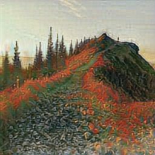
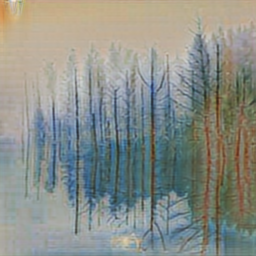

# Contrastive Unpaired Learning (CUT): transfer photo to Monet images

This project is originally published in https://github.com/taesungp/contrastive-unpaired-translation

## Environment
run ```pip install -r requirements.txt```

## Preparation
Download monet_jpg and photo_jpg from Kaggle [I’m Something of a Painter Myself](https://www.kaggle.com/competitions/gan-getting-started/data).

## Training
Put images in corresponding folders:

- photo_jpg content -> 'datasets\photo_to_monet\trainA' 
- monet_jpg content -> 'datasets\photo_to_monet\trainB'.

Run 'train.py' will start training from scratch.

## Testing
The pretrained model (iter=60000) is provided in 'checkpoints\photo_to_monet'. 

Put images in corresponding folders:
- photo_jpg content -> 'datasets\photo_to_monet\testA' 
- monet_jpg  content -> 'datasets\photo_to_monet\testB'.

Run 'test.py' will generate fake Monet images using the pretrained models.

## Results
The generated Monet images can be downloaded from this [link](https://nusu-my.sharepoint.com/:f:/g/personal/e0679941_u_nus_edu/Etsj0gQE_khEvOM3ZucHBb4B4x5fIBAQksvQT_lodn_Zug?e=vMH41A) with NUS account.

Here are some examples:





